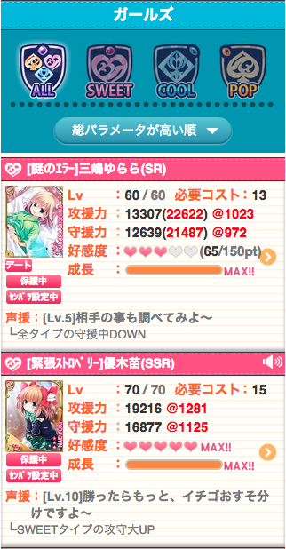

# コスパ表示（カード一覧）
攻守援のコストパフォーマンスを表示します(カード一覧)

■これをブックマーク  
`javascript:(function(){var cards=document.querySelectorAll('section#cardList .listText');for(i=0;i<cards.length;i++){var cost=cards[i].querySelectorAll('dl>div')[0].querySelectorAll('dd>em')[1].innerHTML;var atc_elm=cards[i].querySelectorAll('dl>div')[1].querySelector('dd>em');var def_elm=cards[i].querySelectorAll('dl>div')[2].querySelector('dd>em');var atc=atc_elm.innerHTML.match(/^[0-9]+/);var def=def_elm.innerHTML.match(/^[0-9]+/);var unit;unit=document.createElement('span');unit.className='fcRed';unit.innerHTML='&nbsp;@'+Math.floor(atc/cost);atc_elm.appendChild(unit);unit=document.createElement('span');unit.className='fcRed';unit.innerHTML='&nbsp;@'+Math.floor(def/cost);def_elm.appendChild(unit);}})()`

## サンプル

